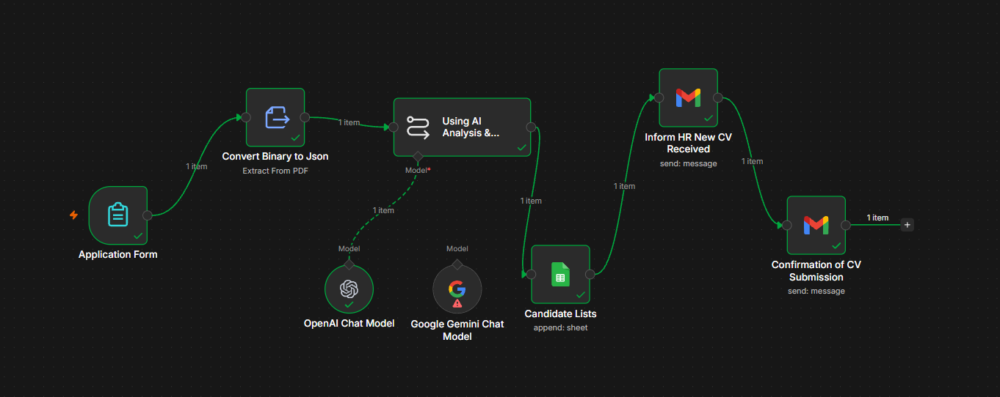

# 🤖 AI-Powered CV Screening Workflow — n8n


---

## 📌 Overview

An end-to-end AI automation workflow built in **n8n** that screens job applicant CVs automatically — from form submission to AI-driven candidate evaluation, HR notification, and applicant confirmation, with zero manual review needed for the initial screening pass.

Recruiters and small teams often spend hours manually reading every CV that comes in just to find out if a candidate is even a reasonable fit. This workflow removes that bottleneck by having an LLM evaluate each CV against the job description the moment it's submitted.

---

## 🖼️ Workflow Preview



---

## ⚙️ How It Works

1. **Application Form** — Candidate fills out a form (Full Name, Email, Salary Expectation, LinkedIn, CV upload as PDF)
2. **Convert Binary to JSON** — The uploaded PDF resume is parsed and extracted into plain text
3. **AI Analysis & Rating** — An LLM (OpenAI GPT-4o-mini, with Google Gemini as an alternate model) compares the extracted resume text against the job description and returns:
   - A compatibility rating (1–10)
   - A clear interview recommendation with reasoning
4. **Candidate List (Google Sheets)** — Candidate details + AI rating are automatically logged into a Google Sheet for the HR team to review and sort
5. **Inform HR** — An email is automatically sent to HR with the candidate's details and AI rating attached
6. **Confirmation Email** — The candidate receives an automatic acknowledgment that their CV was received

---

## 🧩 Nodes Used

| Node | Purpose |
|---|---|
| Form Trigger | Captures candidate application + resume upload |
| Extract From File | Converts PDF resume into readable text |
| LangChain Chain LLM | Sends resume + job description to the AI model for analysis |
| OpenAI Chat Model | Primary LLM (gpt-4o-mini) used for CV evaluation |
| Google Gemini Chat Model | Alternate/secondary LLM option |
| Google Sheets | Logs every candidate + AI rating into a tracking sheet |
| Gmail (x2) | Sends HR notification and candidate confirmation emails |

---

## 💡 Key Design Decisions

- **Strict word limit on AI output** — the prompt caps the AI response at 75 words, keeping HR emails scannable instead of walls of text
- **Structured prompt format** — the LLM is instructed to always return a Compatibility Rating (1–10) + a clear Recommendation, making outputs consistent and easy to compare across candidates
- **Dual LLM setup** — built with both OpenAI and Google Gemini wired in, making the model swappable without rebuilding the workflow
- **Centralized tracking** — every candidate, regardless of outcome, is logged to Google Sheets, creating a simple ATS-lite for small teams without needing dedicated recruiting software

---

## 🎯 Use Case

Built for a **Software Engineer** hiring pipeline, but the workflow is fully reusable — swap the job description in the AI prompt and the form fields to repurpose it for any role.

---

## 🛠️ Tools & Technologies

| Tool | Purpose |
|---|---|
| n8n | Workflow automation / orchestration |
| OpenAI (gpt-4o-mini) | CV-to-job compatibility analysis |
| Google Gemini | Alternate LLM model |
| Google Sheets API | Candidate tracking database |
| Gmail API | Automated email notifications |

---

## 📂 Repository Structure

```
ai-cv-screening-n8n/
│
├── ai-cv-screening-workflow.json      # Importable n8n workflow (credentials redacted)
├── workflow_overview.png
└── README.md
```

---

## ▶️ How to Use This Workflow

1. Import `ai-cv-screening-workflow.json` into your n8n instance (**Workflows → Import from File**)
2. Connect your own credentials for:
   - Gmail OAuth2
   - Google Sheets OAuth2
   - OpenAI API (and/or Google Gemini API)
3. Replace `YOUR_HR_EMAIL@example.com` with your actual HR inbox
4. Replace `YOUR_GOOGLE_SHEET_ID` with your own Google Sheet ID
5. Update the job description inside the **"Using AI Analysis & Rating"** node to match your open role
6. Activate the workflow and share the generated form link with candidates

> ⚠️ All credential IDs and personal email/sheet references have been redacted from the public JSON for privacy. You'll need to reconnect your own accounts after importing.

---

## 👨‍💻 Author

**Bhadur Ali** — Data Analyst & Junior Data Scientist | AI Automation Builder

MS Data Science · PAF-IAST

[](https://linkedin.com/in/bhadur-ali)
[](mailto:alikhansalar5@gmail.com)
[](https://github.com/BhadurAli)
